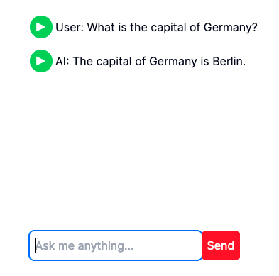

# Next.js Chatbot using ElevenLabs and OpenAI APIs

## Dependencies

This repository has the following dependencies:

- Next.js 14
- Node 18 or higher

## API Keys

You'll need to have active accounts on ElevenLabs and OpenAI in order to use
their APIs.

Edit the `.env` file and add the keys like this:

```
OPENAI_API_KEY=xxxxx
ELEVENLABS_API_KEY=xxxxx
```

## How to run the project

Clone the repository and install the dependencies:

```
npm install
```

Once finished, run the Next.js local server:

```
npm run dev
```

Go to your browser and open `http://localhost:3000`. Ask something to the AI
and wait for the response. You can click on the green button to speak out loud
the text.


