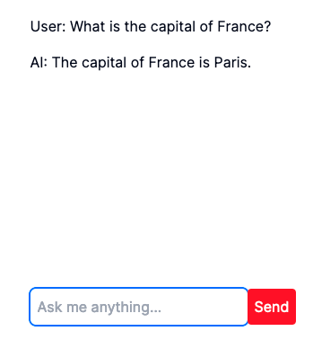

# Building a chatbot using ElevenLabs and OpenAI

In this tutorial, we'll build a simple web-based chatbot together. We’ll use
the [OpenAI API]() to generate responses, and [ElevenLabs API]() to make those
responses sound very natural when they're spoken out loud. Let’s dive in!

## Prerequisites

This tutorial assumes that you have active accounts with ElevenLabs and OpenAI.
If you haven't already done so, go ahead and create these accounts. You'll need
them to retrieve your API keys.

You’ll need Node.js installed on your system. If you don’t have Node.js
installed, install it from [here](https://nodejs.org/en/). You’ll need Node.js version 18 or higher.

Some familiarity with Next.js, TypeScript and API calls is required.

## Source Code

The complete source code for the application can be found on
[GitHub](https://github.com/alnacle/nextjs-chatbot-elevenlabs). Feel free to
fork it if you wish!

## Create a Next.js app

First things first, let’s start by creating a Next.js app. To do this, open
your terminal and run the following command:

```
npx create-next-app@latest ai-chatbot
```

The tool will prompt you with some questions before bootstrapping the project.
If unsure, the questions should be answered as follows:

```
* Would you like to use TypeScript? Yes
* Would you like to use ESLint? Yes
* Would you like to use Tailwind CSS? Yes
* Would you like to use `src/` directory? No
* Would you like to use App Router? Yes
* Would you like to customize the default import alias (@/*)? No
```

Once finished, a new folder called `ai-chatbot` is created, containing the source code of our project. 

Switch to the new folder

```
cd ai-chatbot
```

And run the following command:

```
npm run dev
```

This will start the internal Next.js server. Go to your browser and open
`http://localhost:3000`. If you see the “Welcome to Next.js” screen, then the
project is ready.

## Creating the chatbot UI

We will start the UI of the main page from scratch. Open the app/page.tsx file and replace it with the following content:
export default function Chat() {

```typescript
 return (
     <main className="mx-auto w-full h-screen max-w-xl p-9 flex flex-col">
        <section className="mb-auto m w-full" />
            <form className="md:flex md:justify-center mb-6">
              <input
                      className="rounded-md p-2 text-black"
                      placeholder="Ask me anything..."
              />
            <button
                     type="submit"
                     className="p-2 text-white bg-red-500 rounded hover:bg-red-600">
                  Send
             </button>
           </form>
     </main>
 )}
```

Save the file and observe how the project automatically refreshes in the
browser. Our UI now includes an input box where users can write their
questions, along with a send button that will ultimately dispatch the command
to the AI service.


## Chatbot Implementation

To implement the chatbot functionality, we'll use the official [OpenAI Node SDK](https://github.com/openai/openai-node) along with the [AI SDK](https://github.com/vercel/ai) developed by Vercel. This
combination makes chatbot implementations under Next.js easy and straightforward.

Go ahead and install the dependencies:

```
npm install ai openai
```

### API Credentials

Before we start with the implementation, let's set up our API credentials.
Create a new file in the root folder named `.env`. This file will store all our
API keys.

Now, go to the OpenAI platform and create a new API key (you'll find it under
API Keys in the left navigation menu). Once you've got it, add a new entry to
the .env file like this:

```
OPENAI_API_KEY=xxxxxx
```

We're all set with the credentials to make our API calls! Let's start coding!

### Setting up API Routes

Requests to the OpenAI API are handled using Next.js API Routes, which is one
of the two methods for the client to communicate with the Next.js server. The
alternative method, Server Actions, is not utilized in this tutorial. If you
want to dive deeper into when to use each of these methods, you can check out
the official Next.js [documentation](https://makerkit.dev/how-to/next-supabase/api-routes-vs-server-actions).

That said, here's how you can set up an API route for OpenAI in our Next.js app:

1. Create a new folder called `api` under the `app` directory.
2. Within this directory, create a new folder named `openai`.
3. In this new folder, create a `route.js` file.

In the `route.js` file, let's create an async function to handle `POST` requests from the frontend:

```typescript
export async function POST(req: NextRequest) {

 const { messages } = await req.json()

 const response = await openai.chat.completions.create({
        model: 'gpt-3.5-turbo',
        stream: true,
        messages
 })

 const stream = OpenAIStream(response)
 return new StreamingTextResponse(stream)
}
```

The function receives a `NextRequest` object that includes a JSON-formatted
list of messages. It then makes an API call to the OpenAI create chat
completion endpoint. According to the [documentation](https://platform.openai.com/docs/api-reference/chat/create),
this endpoint accepts several arguments:

* The `model` parameter (required) is set to `gpt-3.5-turbo`, which specifies the model ID family that our call will use.
* The `stream` parameter, set to `true`, enables sending partial message deltas, similar to how ChatGPT works.
* `messages` (required) is a list of messages representing the conversation between us and the AI. Each message object in this list follows this format: role ("system" or “user”) and content (the string message).

After sending the API request, we'll receive a response, which will be
converted into a user-friendly text stream using the `OpenAIStream` method.

### Connecting the client with the API Route

Now, let's enhance the client UI from the previous step to collect what the
user wants to say and display the bot's response.

We will use the [useChat()](https://sdk.vercel.ai/docs/api-reference/use-chat)
hook from the Vercel AI SDK, which enables the streaming of chat messages from
OpenAI, using the POST Route Handler we set up earlier to update the UI
automatically as new messages are received. Start by adding the following code
at the top of your page.tsx file:

```typescript
import { useChat } from 'ai/react'
```

And then, add the following line to the function `Chat()` we created earlier:

```typescript
const { messages, input, handleInputChange, handleSubmit } = useChat()
```

It's time to link each element from the hook with our UI components. Extend the
`input` element to connect with the `input` and `handleInputChange` from the hook:

```typescript
   <input
     className="rounded-md p-2 text-black"
     value={input}
     onChange={handleInputChange}
     placeholder="Tell me anything"
   />
```

Extend the `form` element by adding a new `onSubmit` property that points to
`handleSubmit`. This will pass the user input and the messages to the AI library,
which will then make the API call to the OpenAI SDK.

```typescript
  <form className="md:flex md:justify-center mb-6" onSubmit={handleSubmit}>
```

Finally, update the `section` element under main to display the messages
exchanged between us and the AI:
 
```typescript
    <section className="mb-auto m">
       {messages.map(m => (
         <div className="mb-4" key={m.id}>
           {m.role === 'user' ? 'User: ' : 'AI: '}
           {m.content}
         </div>
       ))}
     </section>
```

### Testing the chatbot

Make sure your Next.js app is running, otherwise run the following command from
the root folder of the project:

```
npm run dev
```

Open your web browser and navigate to `http://localhost:3000`. You'll see a screen similar to this:

Try sending a question to the AI and wait for the response. If everything goes
well, you should see something like this:



## Text-to-Speech Implementation

It's time to level up our chatbot with a cool new feature: text-to-speech! This
way, we can listen to the chatbot speaking both the questions and responses out
loud. 

We'll use the new [ElevenLabs TypeScript SDK](https://github.com/elevenlabs/elevenlabs-js). Let's kick things off by
adding the dependency to our project:

```
npm install elevenlabs
```

### API Credentials

Go to the ElevenLabs website and grab your API key. You’ll find it in your
profile settings. Once you've got it, copy the key and add a new entry to the
`.env` file like this:

```
ELEVENLABS_API_KEY=xxxx
```

### Setting up API Routes

Following the same approach as the previous OpenAI integration, let's create a new file named `route.ts` under the `app/api/elevenlabs` folder.
This file will contain the POST method used to handle the API requests and responses to the ElevenLabs API. The implementation looks like this:

```typescript
export async function POST(req: NextRequest) {

        const { voice, message } = await req.json()

        const response = await elevenlabs.generate({
           voice: voice,
           text: message,
           model_id: "eleven_multilingual_v2"
        });

        return new NextResponse(response);
}
```

The function receives a `NextRequest` object, which contains the voice ID and the
message (string) that will be converted into natural speech. To convert a
string into speech, we'll utilize the generate endpoint from the ElevenLabs
API, wrapped around the generate method from the SDK. According to the
documentation, the method receives three arguments:

* The `voice`, corresponding to the identifier of the voice of the actor that will read the text.
* The `text` to be converted into speech
* And the `model_id`, set to `eleven_multilingual_v2` by default

Once the response is received, the method returns it to the client.

### Connecting the client with the API Route

Let’s extend our client to integrate the API route we have just implemented. 

Add a new button under the section element to convert the corresponding text
into speech commands:

```typescript
   <button className="w-8 h-8 rounded-full text-white bg-green-500"
      onClick={ async () => { speak(m.content) } }>
        &#9658;
   </button>
```
	
Note that the `onClick` attribute will call the `speak` function, passing the
content of the current message (`m` object). Let's implement the speak function:

```typescript
async function speak(message: string) {
        const stream = await fetchStream(message)
        var blob = new Blob([stream], { type: 'audio/mp3' });
        var url = window.URL.createObjectURL(blob)

        window.audio = new Audio();
        window.audio.src = url;
        window.audio.play();
}
```

This code snippet performs several actions:

* It calls the `fetchStream` function passing the message string we want to
convert to natural voice. The `fetchStream` function then executes a `POST`
request to our Next.js App server (`api/elevenlabs`). Unlike the OpenAI
integration, where the AI SDK handles the `POST` request internally, here we
need to handle it ourselves.

* It creates a new `Blob` object from the audio stream data received from `fetchStream`, specifying the MIME type as `audio/mp3`.

* It creates a new `Audio` object and calls the play method to start playing the audio.

### Testing the chatbot

Head over to your browser and navigate to `localhost:3000`. Send a question to
the AI and wait for the response. Notice that a new button appears to the left
of each message in the conversation. Try clicking on one of them and wait for
the ElevenLabs API to return the audio stream (this might take a few seconds
depending on the message's length).

If everything goes well, you should hear a natural female voice reading out
loud your conversation. Congratulations! Your chatbot is now ready to roll!


## Next Steps

The chatbot we've built so far handles basic tasks like sending questions and
vocalizing the text on screen. Here are some ideas to expand its capabilities
with new cool features:

* The chatbot currently uses 'Rachel' as the voice assistant. Use the ElevenLabs API voice endpoint, to allow users to select who will speak out loud the conversation.
* Improve the chatbot by adding a "Save Audio" feature, enabling users to save the audio stream as an MP3 file.
* Extend the UI to make it more appealing to users: give different colors to the conversation based on who's speaking (user or AI), add a cool  loading spinner while sending text to the ElevenLabs API or make the audio responses play automatically when they come in.
